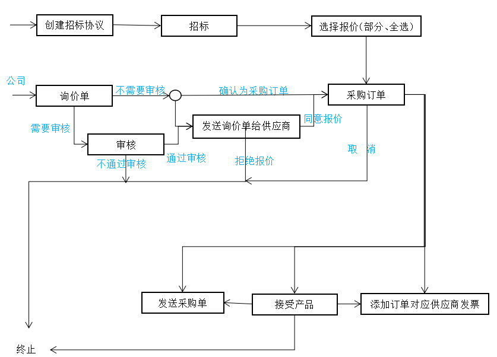

## 采购流程


注意事项
```
说明：
   1.终止不是指所有终止，比如，在接收产品完成以后，仅仅代表着采购结束而退货等操作是交由库存完成的。
   2.若需要验收，则需要库存权限。
```
名词说明

```
询价单：向指定的供应商，询问具体商品的价格，然后我可以选择是否购买

采购订单：当你确定向哪家供应商购买指定的产品（一个或多个）的时候，我就可以创建并确定一个采购订单。
		采购订单在创建并保存，但是没有确定之前，还是询价单。
		
采购单取消：采购单的取消可以在采购模块中设置，是否允许采购单确认以后继续更改

接收产品与验证：验证需要拥有库存权限的时候，你才可以。当你仅仅只是一个采购用户的时候，你就只能接受产品。

提前期:是指某一工作的工作时间周期，即从工作开始到工作结束的时间
```


