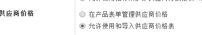
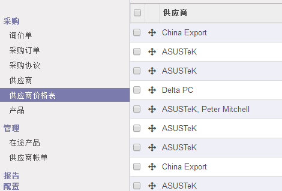
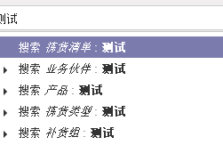
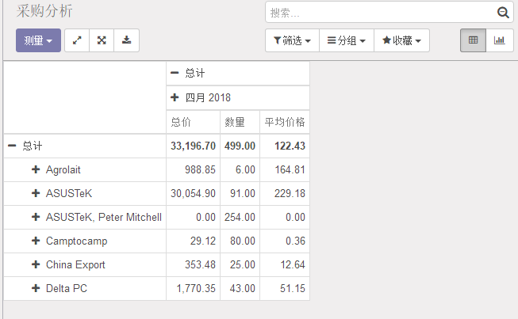

# 重要数据

## 一、如何和销售时使用不同的计量单位进行采购？

```
采购和销售时的产品单位不一样。
比如：我销售水，我销售的单位是瓶，采购的单位是件
```

1. 在odoo中，我们可以在采购和销售中方便地处理不同的计量单位。

2. 安装采购和销售模块

3. 采购模块设置中选择：有些产品销售／采购用不同的计量单位（高级）。

   

4. 指定销售和采购的计量单位
   - 标准计量单位

     ```
     指同一类型的，比如kg和L就不是同一类型，kg是重量，L是体积
     ```

     销售和采购的不同的计量单位必须在同一类型下。类型包括 : 件 , 重量 , 工作时间 , 量 , 等等。

     ```
     小技巧：可以创建你自己的类型和计量单位如果在Odoo标准中不存在的话。
     	比如说，假如odoo中重量中不存在mg，那么我们就可以去设置中找到，添加毫克，类型为重量，比例为1000000。因为重量的计量参考单位是kg
     ```

     ​	当你打开允许计量单位的时候，在产品中就可以选择**计量单位** (会在销售, 库存...中使用)和 **采购计量单位** (采购用)。

   - 创建你自己的计量单位以及计量单位种类

     ​	这两个计量单位是不同的类型。记住, 你不能关联一个现存的单位和不同类型的存在的单位。我们首先要创建一个共享的 单位类型 来处理这两个单位的转换关系。

     ​	我们首先去销售模块中创建两个计量单位，类型为我们自定义的，然后保存以后，我们就可以在产品的计量单位处使用了同一类别的，有一个参考单位，也就是这个类别的参考单位。其他同类型的，都是基于该参考单位设置比例

## 二、怎样在同一产品上设置多个供应商？

1. 创建供应商

   ​	采购模块中有供应商内容，我们可以点击供应商，之后就可以添加新的供应商了。

   ```
   里面又涉及到了销售，会计，税务等等
   ```

   ​

   ```
   **不理解：**
   	注意：如果你不是从采购模块生成联系人, 你需要到 销售采购 标签并标明联系人事 供应商 .如果联系人事是从采购模块创建的, 它会自动勾选。
   ```

2. 之后就可以在产品中选择供应商使用了，可以继续添加多个。

## 三、如何导入供应商的报价单？

1. 需要在采购中设置中设置允许使用和导入供应商价格。

   

2. 当你允许了之后你就会发现，采购中又多出了供应商价格表这个模块.

   

3. 导入供应商价格表之前,我们最好先导出一个正确的格式.导出方式:选择供应商——》动作——》导出——》选择需要导出的字段——》添加——》导出

4. 导入流程：采购——》采购——》供应商价格表——》导入——》选择文件——》选择需要导入的字段——》导入——》之后你就可以查看到变化了

   ```
   问题：此处导入的数据不会全部导入，只会导入前10条
   ```

   ​

5. 当你在导入表中加入新的数据时，会在系统中增加


# 报价单请求

## 四、如何创建询价单

1. 创建询价单

   采购——》采购——》询价单——》创建

2. 你可以将你的询价单保存以后发送给指定的联系人

## 五、如何管理供应商账单

1. 采购应用程序允许你在一个地方无缝地管理你的采购订单、进货产品和供应商账单。

2. 如果你想要设置供应商的控制流程，你的odoo中需要有采购数据。了解什么是采购和接收，是你理解odoo的采购管理流程的第一步。

3. odoo标准工作流程 :
```

   （1）从发送一个报价请求 (RFQ)给你的供应商(们)开始。

   （2）一旦供应商接受这询价单, 确认这询价单为 采购订单(PO) 。

   （3）确认采购当生成一个 新进货物 如果你采购的是库存产品。

   （4）一旦当你从你的供应商处收到一个供应商账单 , 和前一步收到的货物做一个验证来确保准确性。
   
   这个过程也许在同一家公司由三个人做, 也可能只是一个人。
```
4. 涉及库存和财务模块

   （1）新建产品，在产品下面需要着重注意产品类型字段：

   ​	产品设成 库存产品 或 可消耗 将**允许你**追踪它们的库存情况。这些选择意味有库存管理和允许接收这些类型的产品。相反地, 产品被设成 服务 或 电子产品 不会有库存管理, 简单来说, 实际上没有库存可以管理.你将不会收到在这些名称下的产品。

   ​	**小技巧****：建议生成一个 **杂项** 产品对于那些不是经常采购的并且不需要库存评估和管理的产品。如果你创建类似产品, 建议设置产品类型为 **服务** .

   （2）管理你的供应商账单：

   ​	A. 采购产品或服务：创建采购单

   ​	B. 接收产品

   ​		当采购订单中出现了可库存产品，则在订单确认以后，就会出现在库存的仪表盘的待办事项中，当库存中确认以后，整个流程完成。可对该产品进行退货或者报废操作。
   ​		我们可以在搜索框进行搜索：


```
	在搜索时，我们可以添加自己的自定义分组，在搜索处的所搜加号按钮。
该自定义分组，并不是说我们可以自己起名字，而是选择一个分组情况
```

​		C. 管理供应商账单

​   	 	（1）其实就是需要创建一个供应商订单。
​   	 	（2）当你收到一个以前采购的供应商订单的时候，我们需要创建一个新的供应商订单。
```
   	 	提示：你的供应商呢可能寄很多张相同的订单给你，比如
    
			- 你的供应商有欠单并且当他们发货时寄给你账单。
				我的理解是，当第一次发货时，他们就开了一张所有产品的账单给你，但是发货有遗漏，
				之后发货，又寄了遗漏部分的账单
			- 你的供应商寄给你部分账单，或要求押金。
```

​		 (3）供应商账单匹配

```
A. 如果供应商的账单和你收到的产品不匹配怎么办？
  
 	**如果你收到的账单和Odoo自动填写的数量不符.可能原因：**
		a) 供应商错误的包装了你没有订购的产品
		b) 供应商开的发票中包含你还没有收到的产品， 如果开票控制是基于订购或收到数量
		c) 供应商没有为你之前发的产品开发票。
		这些原因告诉你，如果你需要准确的验证账单和其他与此供应商有关的资料。并且知道哪些是你订购的,
        哪些是你已经收到的。		    		
    	
 **如果你不能找到和供应商账单关联的定购单,.可能原因：**
 		a) 供应商已经为这个采购单开了票, 因此它不会再这里出现。
 		b) 公司里某人忘了给这个供应商记录这个采购单。
 		c) 供应商为你打包了你并没有采购的商品。
 		
B. 产品数量如何管理
		a) 一般情况, 服务是基于订单数量管理, 而库存商品和消耗品都是基于到货数量管理
		b) 如果你需要管理产品基于订购数量而不是收到数量, 你需要从 关于Odoo 处激活 开发者模式 。一旦开发者模式被激活, 选择你要更改的产品(s), 你可以看到一个标签是 控制采购订单 的新字段显现。
		c) 然后你可以更改默认管理方法基于 :
			- 订购数量
			- 收到数量
      
C. 批量账单
		其实就是在创建供应商订单的时候，我们可以选择多个采购订单。
```


## 六、如何控制产品接收？(全部&部分)

1. 如果你想要产品的预测和收获在控制下，第一步需要做的就是有效的利用odoo的采购过程。知道已经买了什么，是预测和控制收货的基础。

2. 你需要在产品列表中有该产品的登记，如果没有，请在产品中添加该产品。

   ​	注意：在你创建产品时，产品的字段类型是重要的。对于你很少购买的产品和不想管理库存或购买/销售统计的产品，创建一个杂项产品总是很好的。如果您创建这样的产品，我们建议将他的产品类型字段设置为服务。

3. 控制产品的接收

   （1）采购产品

   ​	创建采购订单

   （2）接收产品
	
   ​	如果你采购实际产品(可库存货可消费产品), 你可以从 库存 程序收取产品。从 库存 仪表盘, 在相应的仓库里找到相应的订单。
	
   ​	你可以直接点击验证，使得整个订单通过，也可以逐个控制。
	
   ​	当你验收的货物的实际收货数量少于初始的需求数量的时候，odoo会要求你产生一个欠单。如果你打算将来收取剩下的产品, 选择 创建欠单 。Odoo会产生一个文件为等待的产品。如果你选择 没有欠单 , 这个订单会被认为已经完成了。

## 七、如何取消一个采购单

1. 由于理解错误, 误操作或者计划变更, 有时必须取消发送给供应商的采购单。Odoo允许你取消一部分或者全部已定购的, 甚至已到达你仓库的货物。

2. 创建询价单，采购订单。

3. 可以取消订单的情况

   （1）当你完全没有确定接收货物的时候。

   ​	Odoo 会自动取消和这个采购单相关的未完成的运输。 采购单 的状态栏上会变成 取消。

   （2）产生的欠单

   ​	当产生欠单时，后面我们可以点击取消

   （3）当我们自己不产生欠单的时候，其实odoo自己已经取消了未完成的采购

4. 创建逆转调拨——退回

   ​	在库存中，完成的订单，我们可以选择退回一部分商品。

## 八、如何设置采购订单的两步验证？

1. 需要在采购的设置中选择：审批层次为2级审批确认采购订单，然后设置审批金额
2. 当员工（采购用户身份）新建的采购金额超过了设置的，便会需要负责人审批。审批通过以后，采购订单便生成成功。

## 九、**如何分析我的供应商的表现？**



1. 如果你的公司通常从几个供应商处采购产品, 统计报告对于你的采购是很有帮助的。跟踪和分析供应商的性能有以下几个原因：

   （1）你可以看到你的公司是如何依赖供应商的；

   （2）你可以协商价格折扣；

   （3）您可以检查每个供应商的平均交货时间；

   （4）等.
```
   例如：一个IT产品零售商通过每周发给多个供应商许多的采购订单, 由此来比较付给每个供应商的总价和供货期。由公司收集到的信息将帮助更好地分析, 预测和规划自己的未来的订单。
```
2. 为了完整的分析供应商的表现，你需要创建询价单

3. 分析供应商

   （1）你可以通过采购模块中的报告中查看供应商的表现（可以通过折线图、条形图和饼图）。

   ​	通过点击 + 和 - 图标, 你可以向上和向下更改信息的显示方式。例如, 我要看到本月所有采购的产品, 我需要点击 + 图标在纵轴的产品上。

   ​	相对于透视表, 图形表只能用一个相关和一个非相关的衡量来计算

4. 定制报表

   ​	你可以按你的需求方便地定制你的采购报告。为此, 点击搜索栏最后的放大镜, 使用在你右手边的 高级搜索视图 。 过滤 选项对显示数据的类别非常有用, 分组 选项可以提高你的报告的可读性。注意你可以过滤和分组现存的字段, 使你的定制非常地弹性化和强大。

   ​	您可以保存并再次使用定制的过滤, 从 高级搜索视图 中点击 收藏 , 然后 保存当前的搜索 。保存的过滤器将从 收藏 菜单访问。


# 采购招标

## 十、怎么管理采购招标?

1．一个 采购招标 (PT), 也称为招标, 是用来推动几个供应商之间的竞争以获得最佳的产品提供清单。在询价比较期间，采购招标被发给多个供应商，确保每个供应商都提供的是一份新的报价单，最后最好的报价单将会脱颖而出。 最有趣的是，这样往往会给您带来一个意想不到的优惠。

2．激活采购招标

采购招标默认是关闭的。需要在设置中，招标选项中选中**允许使用招标从多家供应商得到报价（高级）**

3．创建一个采购招标

（1）在采购模块中，采购中的采购协议（PA）中创建采购招标。

（2）在供应商中，你就可以选择多个供应商。

（3）保存确认以后，我们就可以在同一页面点击新报价单，然后通过邮件发送给供应商。

## 十一、如何在一个采购招标中从两个不同的供应商采购部分产品？

对于某些采购招标(PT).也许有时你只需要从你收到的报价中选择一部分。在Odoo中, 通过 采购 模式中的高级模式可以实现。

1. 激活招标模式

   在招标部分允许从多家供应商招标，并选择高级模式中的高级招标。

2. 选择询价单/招标的部分

   ​	创建采购招标，然后一直到出价选择。之后你可以点开你的招标，展开你收到的产品的报价列表，在你选择的报价后面画  ，然后你选择的商品就会变成蓝色。完成后, 点击 生成采购单 来为每一个产品和供应商生成采购订单。

   ​	当你会到采购招标, 你可以看到状态已变成 PO 已生成 并且 询价单 现在已经是 采购单 或 取消 状态。