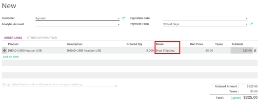
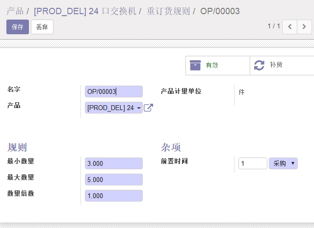
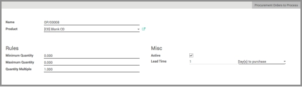
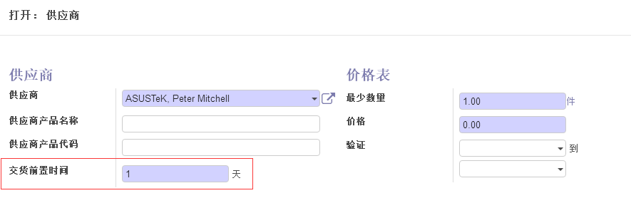
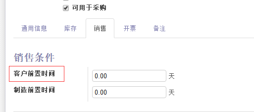

#  补货流程

##  一、如何设置直销(drop-shipping)？

1．首先, 配置 路线 和 直销 。打开菜单 :'**库存**'-->配置-->设置'.在 路线 部分选中 产品使用高级路线 并且在 直销 部分选择 允许供应商发货给你的客户 。

2．在**销售**订单中允许路线选择, 在销售模块, 进入菜单选项 :[UNKNOWN NODE title_reference] 并勾选 在销售订单选择特定的路线(高级) 。

3．如何使用直销？

创建**销售订单**并在相关订单行上选择路线为 直销 。

 

一旦订单被确认, 不会从你的仓库产生移动。货物会从供应商处直接发给客户。

**注解****：**为了能给发货开发票, 你必须在你的产品上设置你的开票政策为 **已订数量**

##  二、**如何设置最小库存规则？**

1．对于某些库存的物品, 设置规则保证来保证有库存是很有用的。(比如, 产品有很高的要求, 需要大量存储空间的不易于保存的物品)

Odoo 允许你设置规则以便基于最小库存自动对这些东西进行补货。

2．什么时候应该**使用**订货规则。

订货规则最好用在**高需求, 高流动**的物品上。这将把你从繁重工作中解放出来, 更多地关注其他事情。

​	它也可以被用在你已经**限制了存储空间并且你需要大量物品在仓库中的情况**。你可以保留一部分在仓库中, 当库存中的物品被卖出时, 订购新的物品作为补充。

3．什么时候应该**避免**订货规则

（1）如果你在卖一个不知道多久才能卖出的产品。你应该首先自己处理你的库存, 并在销售中设置重订货规则来得到更好的预测。

（2）如果你卖的东西具有一定的生命周期, 例如流行物品, 科技产品, 或此产品只是为了某系统的共同发展所需的, 你最好灵活地停止自动补货, 以便避免你不得不低价出售它们。

```
也就是说，当你的商品更新速度快的时候
```


4．例子

我公司销售的现代家具。我们卖了一套桌子和椅子, 椅子配4把和6把两种。

为 了简单起见, 我们分开桌子和椅子的库存, 但是卖给客人时作为一套卖。为了保证我们总能交货一套桌椅。我为椅子设置了一个重订货规则来保证总有10把椅子在仓库中, 但不超过20把。这样我能卖一次卖出5套桌子, 同时保证我的库存较低, 不至于占用我所有的存储空间。

最后卖的桌子配4把椅子, 在我的库存里只有12把椅子。因为库存只剩下8把椅子了, Odoo会自动订购12把新椅子来补充库存到最大数量。

```
小于最小数量时，按最大数量补货，这样可以减少我的补货次数
```


5．配置

（1）设置你的产品

在采购模块, 打开采购菜单点击产品。打开你要添加重订货规则(或者创建一个新的)的产品。

```
重订货规则的产品的产品类型必须是可库存的
```




3 种情况修改订货规则 :

A. 在 :菜单选项:'普通信息-->产品类型', 设置产品为可库存(一旦设好, " 重订货规则"图标会马上显现)

B. 在 :菜单选项 :'库存-->路线'勾选" 买"选项(同时不能勾选Make To Order 选项)

C. 选择一个供应商(别忘了设置最小数量大于0)

（2）创建一个订货规则

点击订货规则页卡(最大数量和最小数量处), 点击创建。会打开新的创建页面。

 

默认情况下, 订货规则在Odoo里被命名为" OP/XXXXX"但你也可以使用自己的命名规则。你能通过“名字“字段修改。

在仓库字段, 选择该产品送货的仓库

如果你设置了多仓库和库位, 在 库位 字段指定该产品储存的库位。

在 **最小数量** 字段, 写入系统要触发补货规则的数量。

在 **最大数量** 字段, 填写你要库存的最大数量。这个补货订单将基于数量来补货。

**数量倍数**是指，一个商品在一次订单中最低购买的数量。例如有的商品只能一套的买，两个。

在杂项部分, 激活 选项允许你激活或关闭这个规则。

在 **提前期**部分, 你可以输入 :

采购的天数(s) :是指供应商收到订单的天数

拿到产品的天数(s)

 

小技巧：默认, 订货至交货的时间是日历天数。你可在 :菜单项:'库存-->配置-->设置-->最小库存规则'处更改它。

当你输入了所有的信息后, 点击保存。

从现在起, 每次一个有订货规则的产品达到最小库存时, 系统会自动发送一个基于你的最大补货数量的请购单给你的供应商。

小技巧：补货会在库存模块的排程器运行时发生。默认情况下, 排程器会在每天晚上12 :00运行。

知道如何配置并手动运行排程器, 请阅读如下文档 [如何配置并运行排程器？](https://www.odoo.com/documentation/user/10.0/zh_CN/inventory/management/misc/schedulers.html)

##  三、**如何基于销售触发采购订单?**

创建销售订单-》询价单中（发送询价订单或者确认订单）——》收货等操作

1．概述

当你采用无库存方式生产方式时, 你无须管理库存所以你直接从你的供应商处采购所需产品。

通常的流程是 :

（1）创建销售订单

（2）采购产品

（3）接收和支付账单

（4）产品交货

（5）给客户开票

2．产品配置

设置产品为购买及按订单为补货方式，选择产品类型为可消耗（并不是可库存），这样当你生成销售订单的时候，odoo会通过补货自动订购相同的数量。


```
  注意：
   -  不要忘了设置供应商否则规则不会被触发。
   -  你也可以配置最小库存规则来触发采购订单。
```

 

3．处理（过程）

（1）销售订单

①　创建销售订单保存以后，我们只能在报价单（销售的）中看到它，此时的状态为报价单。

②　然后在报检单里面找到对应的报价单，确认销售，之后就出现在销售订单和采购模块的询价单中，此时销售订单的状态是等待可用，此时不能验证，但是（管理员）可以强制可用。

③　等待着采购人员确认及采购（大致雷同采购过程），此时销售模块的订单状态是可用，此时也可以直接验证完成，然后odoo会强制完成该订单。

（2）采购订单，被自动创建了

##  四、**在特定供应商购买时如何触发警告?**

```
没有找到该模块
```


##  五、**订单日期和计划日期是怎么计算的?**

目的：计算计划日期是为了能够为交货, 收货等做计划。按照您的公司的习惯, Odoo自动通过排程器生成计划日期。Odoo排程器按行计算每件事, 无论是工单, 交货单, 销售订单, 等等。日期按在Odoo中不同的提前期计算。

1．配置提前期

配置 提前期 是为了计算计划日期的重要步骤。提前期是(在交付, 制造期限, ......)时答应你的不同的合作伙伴和/或客户的延迟时间。不同的提前时间的配置是由如下 :

​	（1）在产品层面

```
①供应商提前期
	供应商交货提前期是供应商需要提供您购买的产品的时间。要配置供应商交货时间选择一个产品,编辑产品，点击供应商，我们就可以设置交货期限了。
	小技巧：可以为一个产品添加多个供应商, 然而不同的交货提前期对应不同的供应商。
	注解：在这种情况下, 安全天数没有影响, 计划交货时间等于:采购订单日期+交货提前期。
②客户提前期
	客户提前期是货物从你的仓库到你的顾客处的时间。它可以为任何产品配置。简单地选择一个产品，在编辑产品中的销售中可以设置客户提前期。
```

**供应商提前期：**

**客户提前期：**



（2）在公司层面

```
在公司层面, 可以合理的使用参数：安全天数，以应付最终的延误，并确保满足您的约定。方法是在延迟的情况下, 从所计算的预定日期减去 备份 天数。

①销售安全天数
	销售安全天使就是 备份 天数, 用来保证你能在约定期内及时交付产品给你的客户。它们是交货提前期的错误边际。方法是从计算出来的计划日期中减去安全天数, 并且计算一个比你承诺给你的客户的更早的计划日期。这样你可以保证实现你的承诺。
设置：

②采购天数
	采购天数和销售安全期的逻辑一样。
	对供应商提前期有一些错误安全边际。当系统生成采购订单对产品进行补货的时候, 它们可以被计划早一些天数用来应付供应商一些未知的不确定的延期。采购提前期可以在销售安全天数的同一个菜单下面看到

```

```
未在设置中通用设置中的配置公司数据中发现该设置
```


（3）在路线层面

内部调拨产生的仓库移动可能也会影响计算日期。

由内部调拨引起的延误可以在为新路线创建一个新的推式规则时在 仓储 模块中被定义。

设置：

```
未发现
```


（4）在文档层面

请求日期

​	Odoo提供了在销售订单上 其他资料 的标签下直接指定客户的请求日期。如果这个日期比理论计算机日期早, Odoo会自动显示警告。

2．例子

例如, 你今天可以销售一辆汽车(1月1号), 该车是按订单补货方式, 并且你已经承诺会在20天内给客户交货(1月20号)<给客户发货的时间>。在该情景下, 排程器可能会根据你的配置触发以下事件 :

```
	1月19号 :实际计划发货(销售安全天数的1天)
	1月18号 :从供应商收货(采购天数的1天)
	1月10号 :给供应商下单的最后期限(供应商交货提前期的9天)
	1月8 号:触发一个采购需求给采购团队, 因为采购部分平均需要2天询价并下单。
```


#  多公司

##  六、如何设置一个多公司（子公司）销售/采购流程？

 

#  故障排除

##  七、一切工作正常时如何巡检？

1．供应商帐单

即使你没有财务的权限, 你仍然可以控制供应商账单。

在 采购 模块 :菜单'控制-->供应商 账单’。

2．产品入库

即使你没有库存模块的权限, 你仍然可以控制入库产品。

在 采购 模块 :菜单:'控制-->入库产品'.

3．补货异常

这里你需要有 采购经理 的权限。

在 库存 模块 :菜单: ‘控制-->采购异常’。

 

 

 