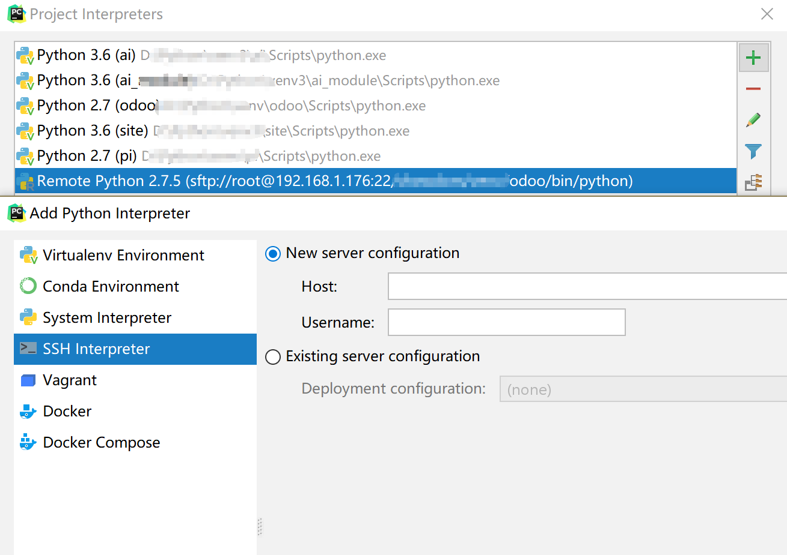
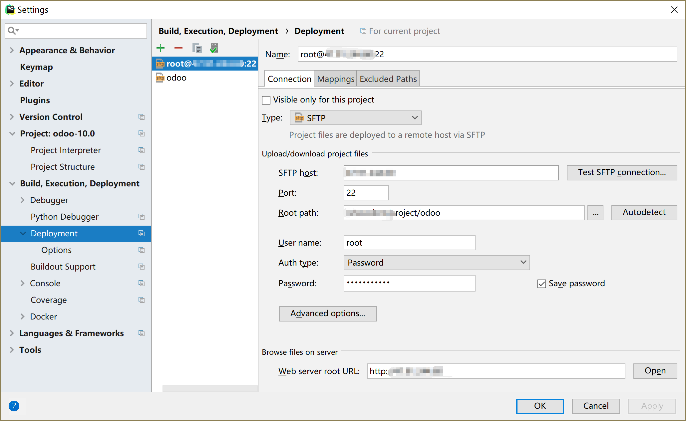

odoo模块开发以及相关技术入门介绍

# odoo开发入门介绍

## 远程环境

* 远程环境



* 远程部署



* 远程调试


## 项目目录

* addons

* odoo

* odoo.conf

* odoo-bin

  命令行直接加参数好像不支持自定义目录，需要定义odoo.conf。

## 模块构建

```
#source ***venv/odoo/bin/python
#odoo-bin scaffold <module name> <path>
```

如果是远程的话需要从远程同步下来。

## 模块目录

* 基本信息manifest
  * 包括`名称name`，描述description，`作者author`，作者网站地址website，`版本version`，`基础数据data`，演示数据demo，分类category，`依赖depends`，许可license，是否自动安装auto_install，是否为应用application，样式集css，是否可网页安装installable，钩子hook（pre_init_hook前执行、post_init_hook安装后和uninstall_hook卸载后）。

  > 文档：https://www.odoo.com/documentation/10.0/reference/module.html

* 静态资源static
  * 模块介绍及应用图标，除了可以在基本信息中添加以外，我们也可以这里也做详细的图文介绍等。
  * 其他资源，包括相关图片、CSS、JS、Less等。

  > 如：account/static

* 网页控制器Web controllers

  * 地址路由Routing
  * 请求Request
  * 响应Response
  * 常规控制器Controllers

  > 如：web/controllers/main.py

* 常规数据data

  * 基础数据
  * 如：account/data/account_data.xml

* 演示数据

  > 如：account/demo/account_demo.xml

* 文档doc

  * 可以直接生成html

  > 如：web/doc/index.rst

* 语言翻译i18n

  > 如：account/i18n/zh_CN.po

* 映射模型models

  > 如：sale/models/res_partner.py

* 视图views

  * 菜单
  * 动作
  * 视图

  > 如：sale/views/sale_views.xml
  >
  > 注意：顺序不能变，至上而下，否则可能会报错。

* 权限security

  * 分组控制Group
  * 访问权限Access
  * 记录规则Rule

  > 如：sale/security

* 报表report

  > 如：sale/report

* 测试

  > sale/tests/test_product_id_change.py

* wizard向导

  * TransientModel临时模型|瞬态
  * 一定时间自动删除
  * 不需要权限

  > 如：addons/account/wizard/account_invoice_refund_view.xml

* 初始化信息init

  > 如：odoo/__init__.py，purchase/__init__.py

## 源码了解

* 会计模块account_accountant
* 采购模块purchase
* 库存模块stock
* 销售模块sale
* 自定义模块leave

## 开发参考

* [官方文档documentation](module.md)
* [映射模型ORM](module.md)
* [数据文件data](module.md)
* [菜单menu](module.md)
* [动作actions](module.md)
* [视图views](module.md)
* [模块module](module.md)
* [命令行cmdline](module.md)


<span id="ycbs">远程部署</span>