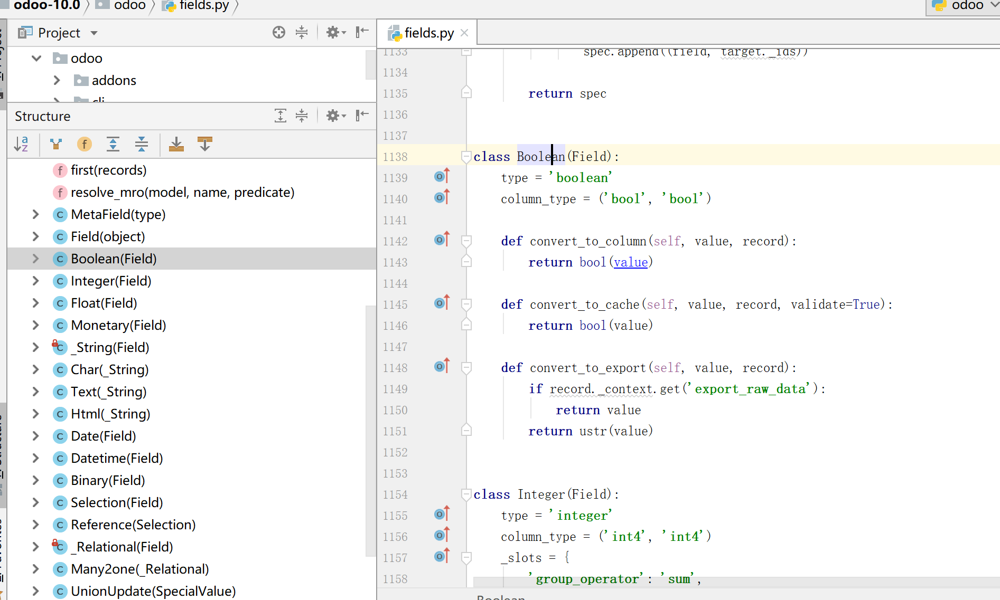

开发主要参考odoo官网

# 开发参考

##映射模型ORM

* 通用属性，string标签名称，required是否必须|是否可为空，help提示语，index是否索引等

* 基本类型，Boolean，Date，Char，Integer等

* 方法字段Creating Models

* 计算字段|依赖字段，依赖于其他字段，需要@api.depends装饰符

* 关联字段

  ```python
  nickname = fields.Char(related='user_id.partner_id.name', store=True)
  ```

* 模型关联，Many2one，One2many以及Many2many

* 保留字段，比如id，create_date，write_uid等



> 文档：https://www.odoo.com/documentation/10.0/reference/orm.html#environment

##数据文件data

* 文件结构Structure
* 记录record
* 视图
* 动作
* 菜单
* 权限
* 模板

> 文档：https://www.odoo.com/documentation/10.0/reference/data.html

##菜单menu

* ir.ui.menu=menuitem

##动作actions

* 窗体ir.actions.act_window
* 链接ir.actions.act_url
* 报表ir.actions.report.xml
* 服务器ir.actions.server
* 客户端ir.actions.client
* 触发方式，菜单项，按钮以及上下文动作等

##视图views

* form表单视图
* tree列表视图
* search搜索视图
* kanban看板视图
* graph图表视图
* gantt视图
* calendar日历视图
* pivot透视图
* 显示位置
* 视图源码

##模块module基本信息

> 文档：https://www.odoo.com/documentation/10.0/reference/module.html

##命令行cmdline

* 创建模块

##控制器controllers

* 地址路由Routing
* 请求Request
* 响应Response
* 常规控制器Controllers

> 如：addons/web/controller/pivot.py

## 工作流workflow

* 创建与定义workflow
* 工作流活动模型workflow_activity
* 工作流流转模型workflow_transition

##安全机制security

* 级别
  * menu级访问
  * object级访问
* 分组控制res.groups
* 访问权限ir.model.access
* 记录规则ir.rule

##报表report

* 模板引擎Qweb，XML生成HTML
* 报表类型report_type，主要有qweb-pdf和qweb-html
* 相关属性，id，name，model等

##基本继承

* 模型继承
* 视图继承
* 模板继承

##官方文档documentation

> 文档：https://www.odoo.com/documentation/10.0/index.html