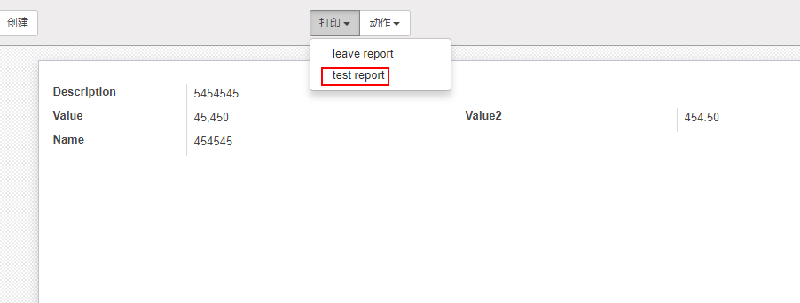

## 自定义报表

1. ### 定义报表

   报表文件定义在模块`report`目录下，通常定义在`模块名_report_views.xml`文件中

   语法：

   使用`report`来定义报表，report具有以下属性，`*`为必填

   - id				用于生成  [*external id*](http://www.odoomk.com/documentation/10.0/glossary.html#term-external-id)  `外部标识` 安装后 可在 ```设置 > 序列与标识符 > 外部标识```查看
   - name*                    视图模板的名称，用于显示或排序，通常定义为`模块.视图名称`，在视图中可以使用视图名称进行搜索
   - model*                   报表挂载在哪个模型上
   - report_type*          报表类型 `qweb-pdf` 或  `qweb-html`
   - string*                     打印按钮下拉列表中的显示名称
   - file                            报表模板所在文件
   - report_name          报告名称，输出pdf文件时的名称
   - groups                     允许查看/使用当前报表的分组
   - attachment_use     如果设置为True，报表将使用由 `attachment` 表达式生成的名称作为记录的附件存储；如果需要报表只生成一次
   - attachment             定义报告名称的Python表达式；该记录可以作为变量 `object` 访问
   - paperformat           希望使用的纸张格式的外部ID（如果未指定，则为默认的纸张格式）

   示例：

   ```xml
   <report
                   string="test report"
                   id="leave_report"
                   model="leave.leave"
                   report_type="qweb-pdf"
                   name="leave.test_report"
                   file="leave.report_report"
           />
   ```

   ​

2. ### 定义报表视图模板

   报表定义好后，需要定义报表视图模板，即报表的正文。模板一般放在`report`  `file`属性标明的文件中

   语法：

   使用`template` 来定义模板，template 具有以下属性：

   * id 				`report` 中定义的视图名称，根据上面的示例当前id应为`test_report`

   示例：

   ```xml
   <template id="test_report">
           test_report
   </template>
   ```

   ​

   ​

3. ### 自定义报表模型

4. ### 查看报表

   报表由报表模块动态生成，可以通过网址直接访问

   * html报表             http://<server-address>/report/html/`report.name`/`记录id`


   * pdf报表               http://<server-address>/report/pdf/`report.name`/`记录id`

   `report.name`             为定义表中的`name`字段

   示例：以html模式访问销售订单报表

   http://<server-address>/report/html/sale.report_saleorder/38 

   ​

