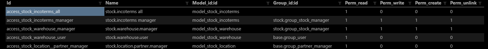

##权限管理

除了使用自定义的代码手动管理访问之外，Odoo还提供了两个主要的数据驱动机制来管理或限制对数据的访问。

这两种机制通过 *分组* 链接到特定的用户：用户属于任何数量的组，并且安全机制与组相关联，由此向用户应用安全机制。

Odoo的权限的核心是权限组（res_groups）。odoo的权限分为四个级别，分别是：

1. 访问级别

   > 设置哪些人可以访问哪些菜单/模型，对象的访问权限包括创建、读、写、删除。 

2. 记录级别

   > 设置哪些人可以访问哪些记录，也就是设置表的查询条件。

3. 字段级别

   > 设置表中的字段的访问权限。

4. 工作流级别

   > 在工作流的每一步迁移中，设置哪些角色允许触发本迁移

   ​

   在模块的 security 目录有两个文件：xxx_security.xml、ir.model.access.csv。与权限相关。

   ​	其中：
   		xxx_security.xml		定义组和组对菜单的访问权限。
   		ir.model.access.csv	定义对模型的访问权限。

### 1. 访问级别

​	由 ir.model.access.csv 记录管理，定义对整个模型的访问。

​	每个访问控制都有一个授予权限的模型，授予的权限以及可选的组

​	访问控制是累加的，对于给定的模型，用户具有访问对其任何组授予的所有权限：如果用户在允许写入的组	中，并且另一个允许删除，则他们可以写入和删除。

​	如果未指定组，则访问控制适用于所有用户，否则仅适用于给定组的成员。

​	可用的权限是创建(perm_create)，搜索和阅读(perm_read)，更新现有记录(perm_write)删除现有记录(perm_unlink)

#### 1.1 定义用户组


* 文件 xxx_security.xml

我们定义 `model="res.groups"` 来定义用户组

```xml
<odoo>
    <data noupdate="0">
        <record id="group_stock_manager" model="res.groups">
            <field name="name">Manager</field>
            <field name="category_id" ref="base.module_category_warehouse_management"/>
            <field name="implied_ids" eval="[(4, ref('group_stock_user'))]"/>
            <field name="users" eval="[(4, ref('base.user_root'))]"/>
        </record>
    </data>
</odoo>
```

>  `noupdate` 		表示当模块升级时是否更新本条数据 对于demo 数据，通常设置成noupdate=”1”，即不更新。默认值是 `noupdate="0"` 更新
>
>  `name`			用户组名称
>
>  `comment`		用户组注释
>
>  `category_id`		用户组所属的模块名
>
>  `implied_ids`		基于哪个用户组	

model 取值类型说明

> `reg.groups`		建立组
>
> `ir.ui.menu`		组菜单控制
>
> `ir.rule`		 权限规则

#### 1.2 定义访问权限

* ir.model.access.csv



> `id`				权限id,默认规则是 `access_模块名_类名`
>
> `name`			权限名，默认规则是 `模块名.类名`
>
> `model_id:id`		这个是固定写法，规则是model_模块名_类名，其它地方引用权限会用这个id
>
> `group_id:id`		组id,这里的**\*base.group_user***是系统内置组，即**\*员工.员工***组，创建帐户时，默认属于这个组。所以给这个组赋权限，相当于给新帐户的默认权限。
>
> `perm_read`		搜索和阅读权限： 1 有权限，0 无权限
>
> `perm_write`		更新现有记录权限： 1 有权限，0 无权限
>
> `perm_create`		创建权限： 1 有权限，0 无权限
>
> `perm_unlink`		删除现有记录权限： 1 有权限，0 无权限

####应用场景

给用户对应的用户组配置了菜单，用户登录后却看不到菜单，这时需要组用户赋予相应的模型访问权限。

### 2. 记录级别

记录规则是记录允许操作（创建，读取，更新或删除）必须满足的条件。在应用访问控制之后，它将跟随记录用。

记录规则具有：

- 适用的模型
- 它应用的权限(例如，如果设置了 `perm_read` ，只有在读取记录时 才会检查规则)
- 规则应用于用户组，如果未指定组，规则为 *global*
- [*domain*](http://www.odoomk.com/documentation/10.0/reference/orm.html#reference-orm-domains) 用于检查给定的记录匹配规则（可访问）或不匹配（不可访问）。上下文中使用两个变量计算域: `user` 是当前用户的记录，`time` 是 [time module](https://docs.python.org/2/library/time.html)

全局规则和组规则（限于特定组的规则与应用于所有用户的组）的使用方式大不相同:

- 全局规则是减法，他们 *必须全部* 匹配以获得可访问的记录
- 组规则是累加的，如果它们 *任意* 匹配（并且所有全局规则匹配），则记录是可访问的

这意味着第一个 *组规则* 限制访问，但任意 *组规则* 进一步扩展它，而 *全局规则* 只能限制访问（或没有效果）

#### 2.1定义记录访问规则

- 文件 xxx_security.xml

我们定义 `model="ir.rule"` 来定义记录访问权限

```xml
<odoo>
    <data noupdate="0">
        <record id="rule_user_qingjia_qingjiadan" model="ir.rule">
          <field name="name">自己编辑自己的请假单</field>
          <field name="model_id" ref="model_qingjia_qingjiadan" />
          <field name="domain_force">[('create_uid','=',user.id)]</field>
          <field name="groups" eval="[(4,ref('base.group_user'))]"/>
        </record>
    </data>
</odoo>
```

> `model_id`		模块id，对应**\*ir.model.access.csv***文件中定义的**\*model_id***
>
> `domain_force`	domain表达式，**'create_uid'**是**qiangjia_qingjiadan**表的字段，在insert数据时，odoo自动写入添加用户的id。**user.id**是当前用户id。这个domain表达式的含义就是请假单数据的添加用户id等于当前用户id。
>
> `groups`			组id,**base.group_user**前面说过，是系统内置的员工组的外部id

####应用场景

请假模块中，员工A下了一个请假单，员工B登录也能看A的请假单，我们要让A的只能看到自己的请假单，这时我就要配置相应的记录访问权限。[场景说明](https://zhuanlan.zhihu.com/p/29130388)

### 3. 字段级别

ORM [`Field`](http://www.odoomk.com/documentation/10.0/reference/orm.html#odoo.fields.Field) 可以有一个 `groups` 属性提供组列表（以逗号分隔的字符串 [*external identifiers*](http://www.odoomk.com/documentation/10.0/glossary.html#term-external-identifiers))。

如果当前用户不在列出的组中，他将无权访问该字段

- 受限字段将从请求的视图中自动删除
- 限制字段从 [`fields_get()`](http://www.odoomk.com/documentation/10.0/reference/orm.html#odoo.models.Model.fields_get) 响应中删除
- 尝试（显示）读取或写入受限字段会导致访问错误

#### 3.1定义字段访问权限

##### 3.1.1 在视图中定义字段访问权限

```xml
<field name="arch" type="xml">
    <form string="Scheduled Products">
        <group col="4"><!--4为内容的员工组-->
            <field name="name"/>
            <field name="product_id"/>
            <field name="product_qty"/>
            <!--通过在字段中加入属性groups来限定可访问的用户组-->
            <field name="product_uom" groups="product.group_uom"/>
            <field name="product_uos_qty" groups="product.group_uos"/>
            <field name="product_uos" groups="product.group_uos"/>
        </group>
    </form>
</field>
```

##### 3.1.2 在字段对象定义中指定访问权限

```python
_columns = {
       "gengo_private_key": fields.text("Gengo Private Key", copy=False, groups="base.group_system"),
       "gengo_public_key": fields.text("Gengo Public Key", copy=False, groups="base.group_user"),
       "gengo_comment": fields.text("Comments", help="This comment will be automatically be enclosed in each an every request sent to Gengo", groups="base.group_user"),
       "gengo_auto_approve": fields.boolean("Auto Approve Translation ?", help="Jobs are Automatically Approved by Gengo.", groups="base.group_user"),
       "gengo_sandbox": fields.boolean("Sandbox Mode", help="Check this box if you're using the sandbox mode of Gengo, mainly used for testing purpose."),
}
```

> 我们在模型字段定义时，可以通过groups限定用户组的方式定义权限

#### 3.1.3 通过隐藏的方式限定访问

- 直接隐藏

```xml
<group name="owner" position="attributes">
    <attribute name="invisible">True</attribute>
</group>
```

- 满足某些条件的隐藏
```xml
<xpath expr="//field[@name='parent_id']" position='attributes'>
    <attribute name="attrs">{'invisible': [('passenger','=', True)]}</attribute>
</xpath>
```
- 通过组来隐藏
```xml
<xpath expr="//field[@name='type']" position="attributes">
    <attribute name="groups">base.group_no_one</attribute>
</xpath>
```
- 菜单的隐藏
```xml
<record model="ir.ui.menu" id="crm.menu_crm_opportunities">
    <field eval="[(6,0, [ref('base.group_no_one'),])]" name="groups_id"/>
</record>
```

### 4. 工作流级别

工作流转换可以限制到特定组。群组外的用户不能触发转换