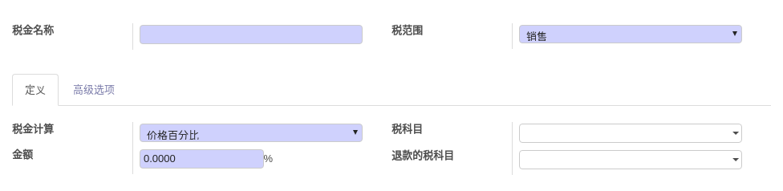
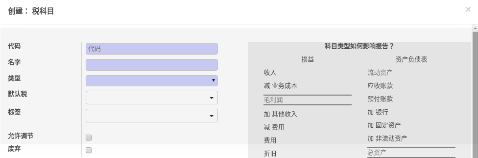

# 销售

[官方资料](https://cdn.openerp.hk/sale)

## 销售操作流程

## 报价单

​	报价单的重要信息包括，客户信息，产品信息，税金，条款和条件。

#### 1.客户信息

​	可以从联系人中查找，或者新建联系人添加信息！

#### 2.产品信息

​	可以从库存产品中获取，也可以新建产品添加相关产品信息。

#### 3.税金

​	税金需要新建或者从已有的税金项中选取，税金的配置涉及专业财务知识！odoo中需要配置的项目如下图：

	

#### 4.条款条件

​	每个卖家都应该声明包括自己的产品和公司政策的所有正式信息，以方便客户在做出决定前阅读所有的这些条款，条款条件可理解为报价单的附加信息！

​	基于以上信息生成报价单

## 开票

​	官方文档：https://cdn.openerp.hk/sale_2

​	销售订单->开票

​	销售订单->交货->开票

​	再发性合同->开票

​	电商订单->开票

## 

