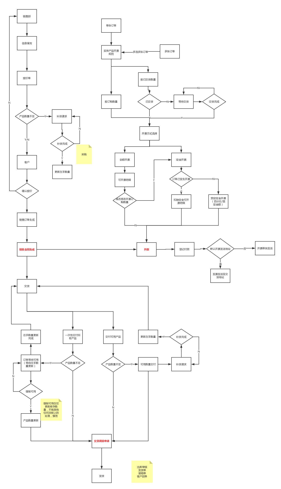
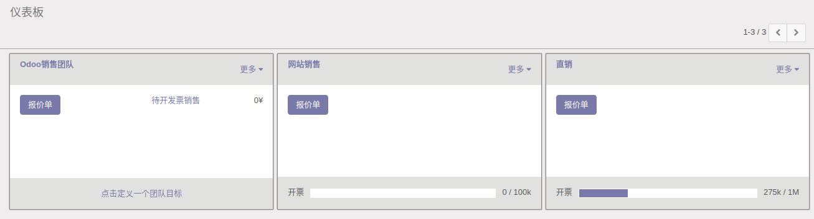
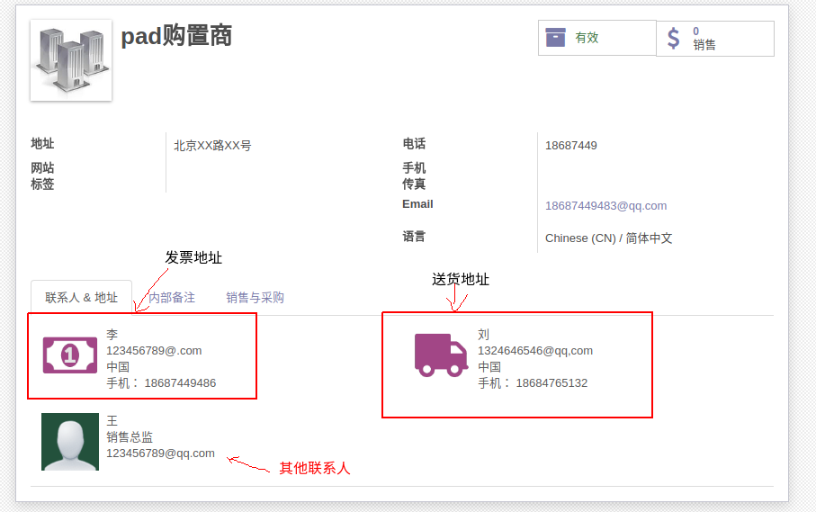
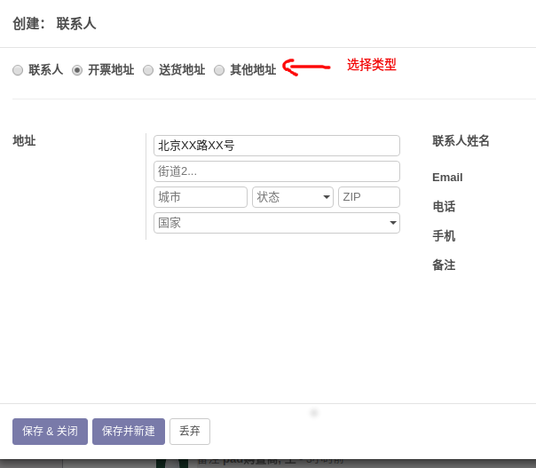
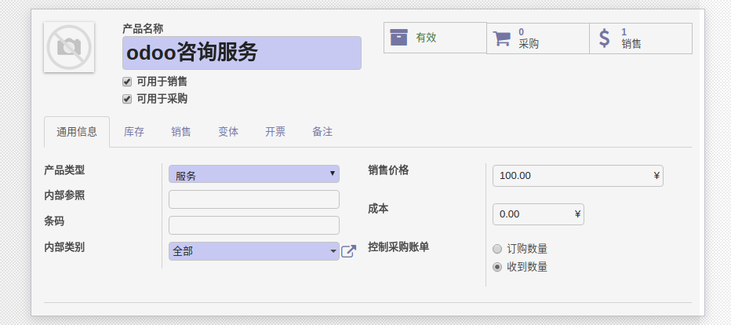
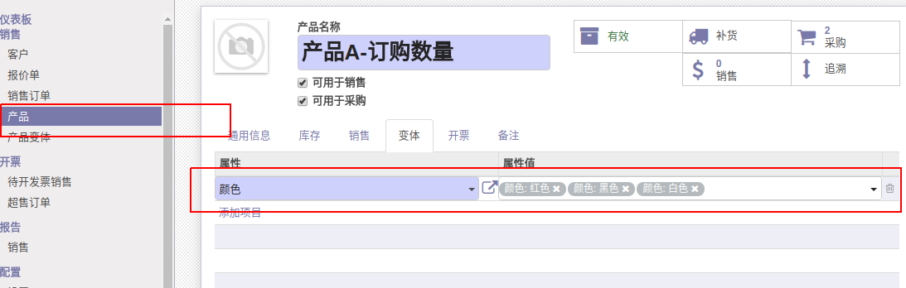
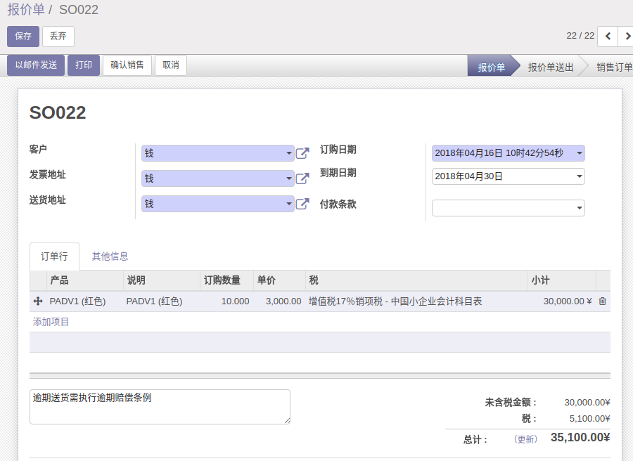
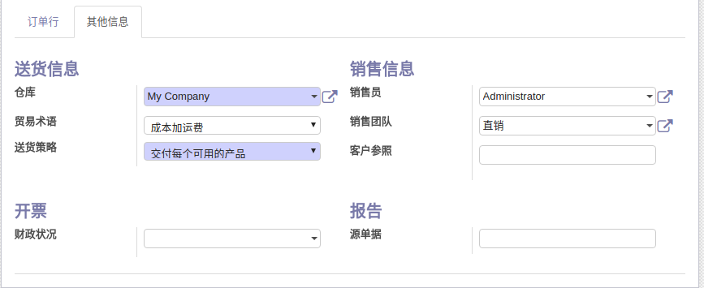
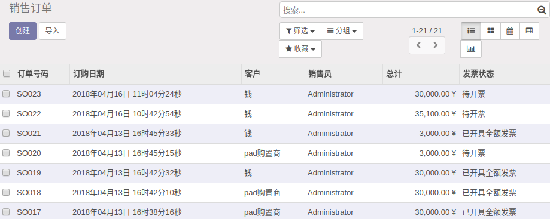

# 销售

[官方资料](https://cdn.openerp.hk/sale)

## 操作及业务流程

## 仪表板

​	仪表盘是显示销售团队，或者销售种类的一个分类模块，用于区分销售订单的类型或者销售订单所属团队！

​	系统将默认产生两种类型的销售订单，分别是网站销售和直销，如果跳过仪表盘设置销售订单则默认为直销订单！

​	仪表盘可显示当前分类已开发票总额

## 客户

​	当前模块为基础客户信息，与应用中的联系人模块共享数据！

​	当前模块可查询客户的销售记录，开票记录等信息。

​	客户有两种类型，一种是个人客户，一种是公司客户，配置上无实质区别。如果客户要求发票地址与送货地址不同则需要针对当前客户在联系人中单独添加发票地址和收货地址。

### 其他客户信息：

​	会计分录：会计分录是指预先确定每笔经济业务所涉及的账户名称，以及计入账户的方向和金额的一种记录。

​	客户付款条款和供应商付款条款：这个配置在客户的销售订单中有手动填写项，比较灵活，这里可以不用填写。

​	财政信息：用于确定合作伙伴的税金。

## 产品

​	产品信息面板如下：

​	可用于销售和可用于采购即字面意思，很多配置项名称字面意思很明确不做过多解释，下面是一些生涩的不好懂的配置项解释：

​	产品类型：可消耗指不需要库存的产品，服务类型指非物质产品，可库存产品指需要库存的实体产品。

​	内部参照：指当前产品的内部名称或者代码编号。

​	条码：产品条码编号。

​	内部类：公司区分产品的类别。

​	控制采购账单：按订购数量指，当生成采购订单后，供应商账单中商品默认数量为订购总数量。按收到数量指，当系统中的收货步骤完成验证后，生成的供应商账单中商品默认数量为收到的货物的数量。

​	库存部分：请到库存模块了解。

​	客户前置时间：下单后送达客户手中允许的延期时间。

​	产品变体：同一型号不同属性的产品，比如一个产品有多种不同颜色外观。

​	开票信息：涉及到专业的财务知识，请到财务会计模块了解。

​	开票策略：按订购数量开票指当产品产生销售订单即可开票，按已交货数量开票指当产品到达客户手中才可开票。

## 产品变体

​	同一型号不同属性的产品，比如一个产品有多种不同颜色外观。建议在产品的变体属性中添加产品变体属性，在变体列表中做管理。

	

## 报价单

​	报价单面变如下：

	

​	主要信息：包括客户对象，发票地址，送货地址，订购日期，到期日期，付款条款，条款条件。

​	订单信息：包括产品名，订购数量，单价，税。

​	贸易术语：贸易术语（Trade Terms）也被称为[价格术语](https://baike.baidu.com/item/%E4%BB%B7%E6%A0%BC%E6%9C%AF%E8%AF%AD)（Price Terms），是在长期的国际贸易实践中产生的，用来表示成交价格的构成和[交货条件](https://baike.baidu.com/item/%E4%BA%A4%E8%B4%A7%E6%9D%A1%E4%BB%B6)，确定买卖双方风险、责任、费用划分等问题的专门用语。

​	送货策略：交付每个可用产品指库存不足时交付已有的产品，剩余的产品等待补货完成再次发货。选择一次性交付所有产品时，库存不足不允许发货，等待库存补货达到订单数量才能发货。			

## 销售订单

​	销售订单生成代表客户已经和公司打成销售协议，销售的单据信息基本不会再有变动！销售订单格式及内容基于报价单生成，销售订单生成并且验证完成即可申请发货和打印销售订单。

​	销售订单列表可查看相关销售历史记录及其状态。

## 开票

​	开票流程请参照系统业务流程图了解详细开票信息。

​	开票在财务上用于确认销售收入，并依次作为收款凭证，开票规则用于在开票时确认开票金额的依据。

​	开票涉及的模块包括销售，库存，财务。	

​	开票规则一般有三种：按订单金额，按实际交货数量，按时间和材料成本。

​	按订单金额为销售订单生成完成后就可以开票

​	按实际交货数量为交货完成后才能开票

服务类产品开票：

通过工时表记录服务交付数量

​	连接桥梁：Analytic Account（成本分析科目）模块

​	当订单明细中有服务类型的产品并且其追踪服务的方式是通哦过工时表追踪时，系统自动为订单分配成本分析科目

​	当员工在工时表商登记服务时间时可选择订单所对应的成本分析科目，这样登记的服务时间即为该订单所交付的服务时间

按时间和材料成本

连接桥梁：Analytic Account（成本分析科目）模块

按工时开票

将材料采购以及项目的费用开支及员工报销费用向客户开票收费

开票模式有按成本或按指定标价

## 配置

​	常用配置：产品变体配置，地址配置，送货配置

## 注意！

1.强制可用问题

​	在产品数量无法满足发货规则所含数量时，强制更新产品可用数量，odoo只会更新产品数量，其他不做任何处理，强制可用需要谨慎使用。

